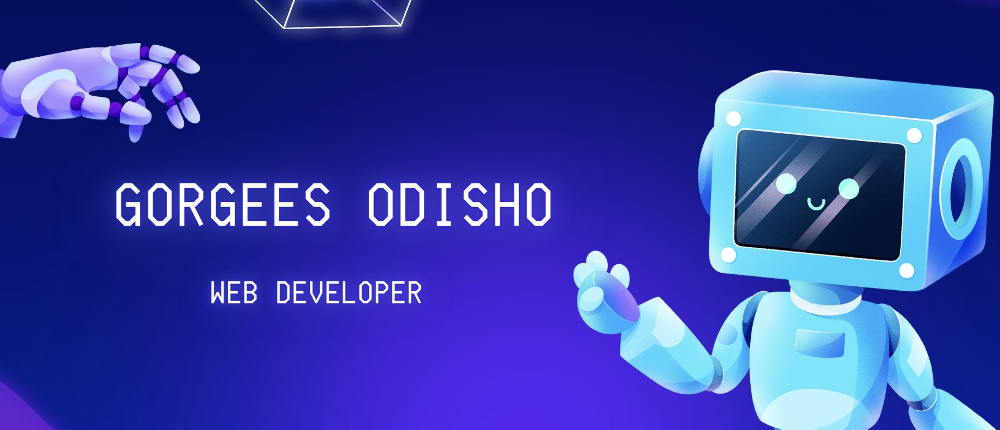

  

  

<h1 align="center">
  hey there
  
</h1>

  

  

👋 This's Gorgees, I'm diving into the realm of web development, fascinated by how computers, websites, and technology come to life! 🚀

💡 As a web developer, I bring expertise in HTML, CSS, JavaScript, TypeScript, React, Next.js, Redux, Tailwind, GitHub, Linux, Python, and Node.js to the table for front-end development.

🕵️‍♂️ I've always been curious about the behind-the-scenes stuff, so I started digging into how all these tech wonders actually work. Started learning a couple of years ago, and man, it was tough at first! But CS50 opened my eyes to the exciting world of computer science, and I fell in love with coding and problem-solving.

 💻 Additionally, I underwent an immersive learning experience at the ReCoder bootcamp, refining my skills and deepening my understanding of software development & I've gained invaluable experience in collaborating with my team and our exceptional trainers. 

🌟 Sci-fi movies are my jam! They spark my imagination and drive me to explore new things. I'm all about building my own stuff, dreaming of the day when the kind of tech we see in those movies becomes real.

🛠️ Learning how to code solo is cool, but I've also learned that teamwork rocks! Collaborating with others has shown me how combining different ideas can lead to amazing results.

🚀 Let's team up, dream big, and code our way into the future! Hit me up—I'm always down for a chat about tech, coding, or the latest sci-fi flick. Cheers to the journey ahead! 🌌✨

<!--
**gorgees04/gorgees04** is a ✨ _special_ ✨ repository because its `README.md` (this file) appears on your GitHub profile.

Here are some ideas to get you started:

- 🔭 I’m currently working on ...
- 🌱 I’m currently learning ...
- 👯 I’m looking to collaborate on ...
- 🤔 I’m looking for help with ...
- 💬 Ask me about ...
- 📫 How to reach me: ...
- 😄 Pronouns: ...
- ⚡ Fun fact: ...
-->
