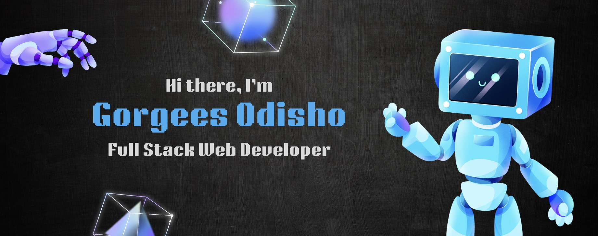

## 👨‍💻 Full Stack Web Developer | 💻 Tech Enthusiast | 🚀 Sci-Fi Aficionado

I'm a **Full Stack Web developer** diving into the realm of web development, fascinated by how computers, websites, and technology come to life! I have experience in both front-end and back-end development, where I focus on creating engaging user experiences. I enjoy using React, Redux, and Tailwind CSS for the front-end, along with other tools. On the back-end, I work with PostgreSQL and Node.js to build strong API servers. I handle tasks like authentication, authorization, and explore different databases like MongoDB. I have a strong passion for problem-solving, particularly in the realm of **data structures** and **algorithms**.

Let's team up, dream big, and code our way into the future! Hit me up—I'm always down for a chat about tech, coding, or the latest sci-fi flick. Cheers to the journey ahead!

Want to know more about me ? check out my [**portofolio**](https://gorgees.vercel.app/)  

# 💻 Tech Stack:

                                    

# 📊 GitHub Stats:

&nbsp;&nbsp;

 

### ✍️ Random Dev Quote

---

<!-- Proudly created with GPRM ( https://gprm.itsvg.in ) -->
